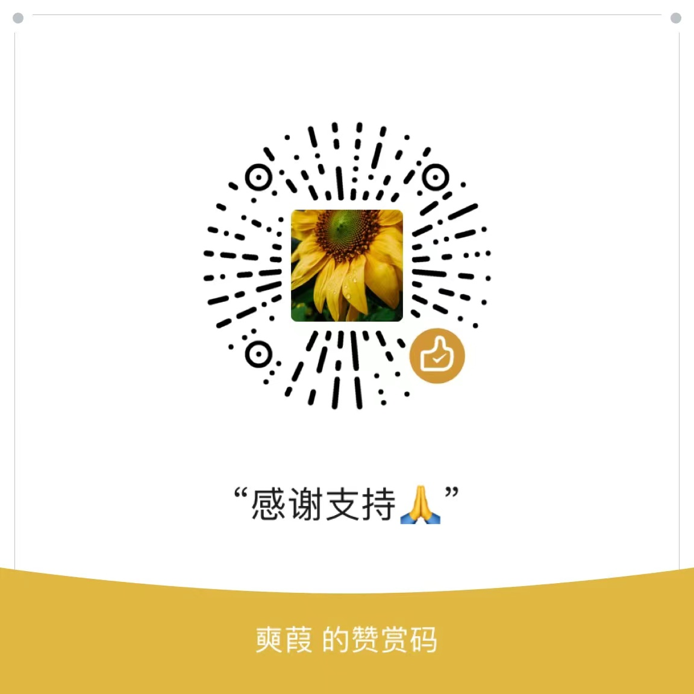
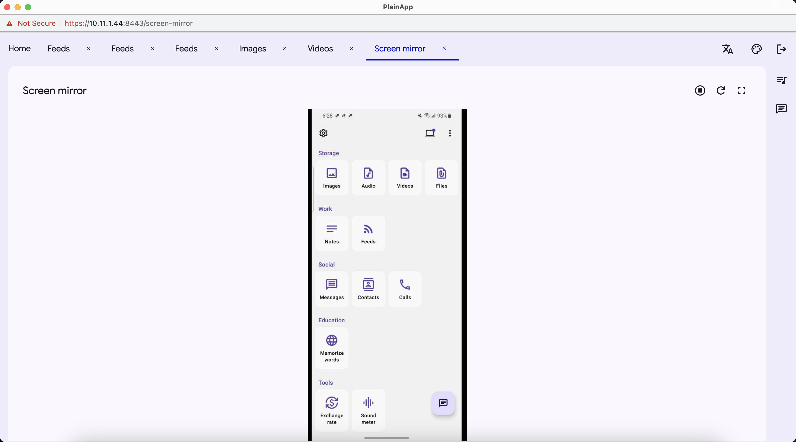
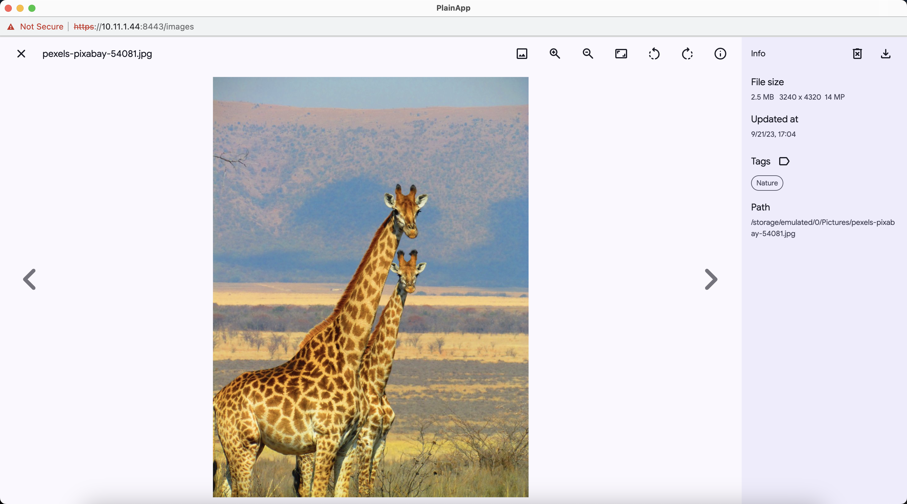
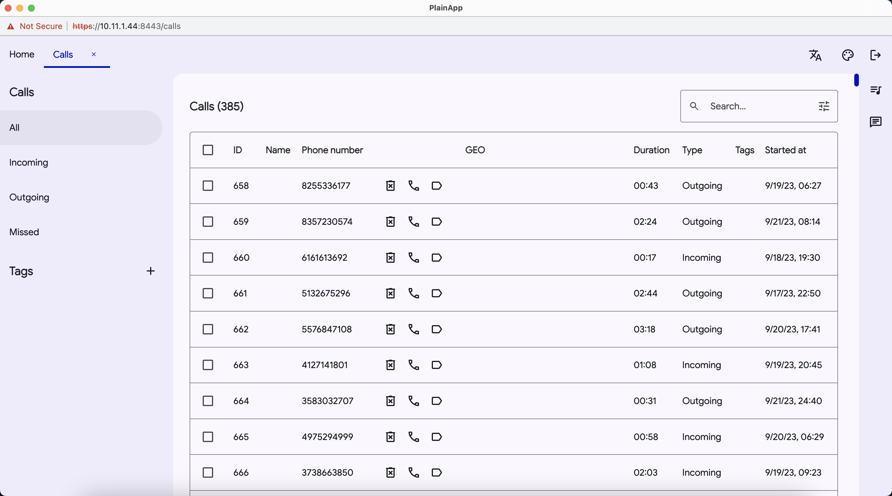

# PlainApp

<a href="README_zh_CN.md">中文</a>

PlainApp is an open-source application that allows you to manage your phone through a web browser. Access files, videos, music, contacts, sms, calls, and more from your desktop using a secure, easy to use web interface!

[](https://play.google.com/store/apps/details?id=com.ismartcoding.plain)
[](https://f-droid.org/packages/com.ismartcoding.plain/)
[](https://github.com/ismartcoding/plain-app/releases/latest)

## Features

- Privacy oriented: We take your privacy seriously and use TLS + AES-GCM-256 encryption to ensure your data is secure.
- Ad-free forever: You won't be bombarded with ads when using PlainApp.
- No cloud services or third-party data storage: All data is kept on your device, so you have complete control over your information.
- No Firebase Cloud Messaging/Analytics: We don't track your activity or use your data for advertising purposes. We only collect crash logs through Firebase Crashlytics.
- User-friendly: PlainApp has a modern, customizable interface with multi-language support, light/dark theme options, and e-ink screen compatibility.
- Desktop management: You can manage your phone from your desktop by visiting a self-hosted webpage wirelessly.
- Contacts management: You can manage these features on the self-hosted webpage as well.
- File management: Manage files, images, videos, and audio on the self-hosted webpage.
- Note-taking: Use PlainApp to manage your notes with a built-in Markdown editor.
- RSS reader: Read articles in a clean UI.
- TV casting: Cast your videos, images, and audio to your TV.
- Video and audio playback: Play videos and audio in the app and on the webpage.
- Backup and export: Backup and export your app data for safekeeping.
- ChatGPT conversation UI (web only)
- SMS, Calls: Read your SMS and calls on webpage.(Apk only)
- Apps: View your apps and download apk from phone.(web only)
- Screen mirror: Mirror your phone on webpage.
- Tools: Exchange rate, Sound meter.
- Notifications: You can manage push notifications on the webpage.
- And more features are planned for the future.

PlainApp's minimalist design is intentional, so you can focus on what matters most: your valuable data.

Video: https://www.youtube.com/watch?v=RvO18j4r95o

Reddit: https://www.reddit.com/r/plainapp

Discord: https://discord.gg/RQWcS6DEEe

## Disclaimer

- ⚠️ The project is under **very active** development.
- ⚠️ Expect bugs and breaking changes.
- ⚠️ It is not perfect, I am always looking for ways to improve. If you find that the app is missing a certain feature, please don't hesitate to submit a feature request.
- ⚠️ I kindly request everyone to ask questions and engage in discussions in a friendly manner.

## Donations :heart:

**This project needs you!** If you would like to support this project's further development, the creator of this project or the continuous maintenance of this project, **feel free to donate**.

Your donation is highly appreciated. Thank you!

- [Buy me a cup of Ko-Fi!](https://ko-fi.com/ismartcoding)

- Use WeChat to scan the code



## Screenshots

|    |             |                     |                      |
|--------------------------------------|-----------------------------------------|-----------------------------------------------|--------------------------------------------------|
|          |            |                  |                        |
|     |    |          |               |
|   |  |      |         |
|  |          |  |  |
|   |        |       |                                                  |

## Compatibility

PlainApp requires Android 9.0 or higher.

## Roadmap

- ❌ Not Started
- 🟡 In Progress
- ✅ Completed

| Feature                                                   | WEB | APP |
|-----------------------------------------------------------|:---:|:---:|
| Material You Theme                                        | ✅  | 🟡  |
| Share Files via Web Link                                  |  ❌  |  ❌  |
| Messaging between Phones with PlainApp (Bluetooth, Wi-Fi) |  ❌  |  ❌  |
| Translation Dictionary                                    |  ❌  |  ❌  |
| Books                                                     |  ❌  |  ❌  |
| To do list                                                |  ❌  |  ❌  |

The ultimate goal is to turn smartphones into personal data and knowledge managers, allowing individuals to more easily exchange knowledge and data with each other through PlainApp.

## FAQ

### Doesn't work. Neither https nor http.

1. Double check the IP address and port number.
2. Your PC and mobile device must be in the same Wi-Fi network. 
3. Try open the webpage on your mobile device see if it works. If it works, then it's a network issue.
4. Try open the webpage on your PC using incognito mode see if it works. If it works, then it's a browser extension issue.
5. Try open the webpage on your PC using another browser see if it works. If it works, then it's a browser issue.
6. Try open the webpage on your PC using another PC see if it works. If it works, then it's a PC issue.

### Why can't I find Messages or Calls in the Social section on my webpage's Home tab?

Google Play Store doesn't allow PlainApp to use SMS and Call Permissions. You can access these features on versions from F-droid and GitHub.

### When connecting my mobile to my PC using HTTPS, a warning appears in the browser saying, "Your connection is not private. Attackers may try to steal your information from x.x.x.x (e.g., passwords, messages, or credit cards)."

The warning is because of a self-signed TLS certificate, and there's no direct way to remove it. You can proceed by clicking "Proceed to x.x.x.x (unsafe)." Despite the warning, data between the mobile app and web interface is encrypted.

### Why screen mirror is not working?

Try use the latest version of Chrome.

### Why can't I receive the desktop notifications?

Grant Chrome Notification Permission on Windows/Mac/Linux
Go to Settings > System > Notifications & actions and make sure the Notifications option is toggled on for Chrome.

### I don't believe this app.

It's worth mentioning that this is an open-source application. 
If you have doubts, you can either build your own version or choose not to use it.

## Support

If you encounter any issues, feel free to open an issue on GitHub. I am always happy to help. Please do not give a one-star rating arbitrarily.

## Download GraphQL schema from PlainBox

```bash
./gradlew downloadApolloSchema \
  --endpoint="http://<box-ip>:8080/graphql" \
  --schema="app/src/main/graphql/com/ismartcoding/plain/schema.graphqls" \
  --header="Authorization: Bearer <token>"
```

## Build

1. Generate `release.jks` file under `$rootProject/app` folder.

```bash
keytool -genkey -v -keystore ./app/release.jks -keyalg RSA -keysize 2048 -validity 10000 -alias plain
```

2. Create `keystore.properties` file with following content under `$rootProject` folder.

```
storePassword=
keyPassword=
keyAlias=plain
storeFile=release.jks
```

## Star history

[](https://star-history.com/#ismartcoding/plain-app&Date)


