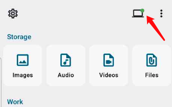
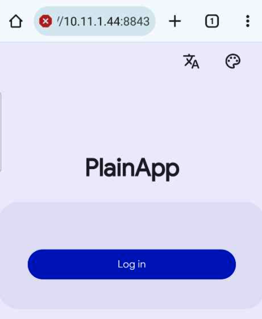
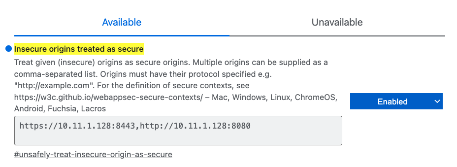
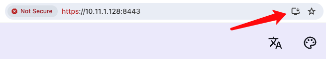

# PlainApp - 简朴

<a href="README.md">English</a>

简朴是一个开源应用，允许您通过网络浏览器管理您的手机。您可以通过安全、易于使用的网络界面从桌面访问文件、视频、音乐、联系人、短信、通话记录等等！

[](https://play.google.com/store/apps/details?id=com.ismartcoding.plain)
[](https://f-droid.org/packages/com.ismartcoding.plain/)
[](https://github.com/ismartcoding/plain-app/releases/latest)

## 功能

- 关注隐私：并使用 TLS + AES-GCM-256 加密，确保您的数据安全。
- 永久无广告：在使用简朴时，您不会被广告轰炸。
- 无云服务或第三方数据存储：所有数据保存在您的设备上，因此您完全控制您的信息。
- 无 Firebase Cloud Messaging/Analytics：不追踪您的活动，也不将您的数据用于广告目的。只通过 Firebase Crashlytics 收集崩溃日志。
- 用户友好：PlainApp 拥有现代、可自定义的界面，支持多语言，提供浅色/深色主题选项，并支持电子墨水屏幕。
- 桌面管理：您可以通过访问自托管的网页在桌面上管理您的手机。
- 联系人管理：您也可以在自托管的网页上管理这些功能。
- 文件管理：在自托管的网页上管理文件（内部存储、 SD卡、USB存储）、图像、视频和音频。
- 记事本功能：使用内置的Markdown编辑器中管理您的笔记。
- RSS 阅读器：在干净的界面中阅读文章。
- 电视投射：将您的视频、图像和音频投射到您的电视上。
- 视频和音频播放：在应用内和网页上播放视频和音频。
- 备份和导出：备份和导出您的应用数据以进行安全保存。
- ChatGPT 对话界面（仅限网页）
- 短信、通话：在网页上阅读您的短信和通话记录。（仅限Apk版）
- 应用程序：查看您的应用程序并从手机下载apk。（仅限网页）
- 屏幕镜像：在网页上镜像您的手机屏幕。
- 工具：汇率、声音测量仪。
- 通知：您可以在网页上管理推送通知。
- 设备信息：您可以在网页上查看您的设备信息。
- PWA支持：您可以将网页添加到主屏幕，体验像桌面应用程序一样使用网页的便利性。
- 还有更多功能计划在未来推出。

简朴的极简设计是有意为之，让您能够专注于最重要的事情：您宝贵的数据。

视频: https://www.youtube.com/watch?v=RvO18j4r95o

Reddit: https://www.reddit.com/r/plainapp

Discord: https://discord.gg/RQWcS6DEEe

## 免责声明

- ⚠️ 本项目正处于**非常活跃**的开发阶段。
- ⚠️ 请预期可能会有错误和突破性的变更。
- ⚠️ 该项目并不完美，我始终在寻找改进的方法。如果您发现应用程序缺少某个功能，请随时提交功能请求。
- ⚠️ 我恳请大家友好地提问并参与讨论。

## 捐赠 :heart:

**这个项目需要您！** 如果您希望支持这个项目的进一步开发，支持项目的创作者或持续的维护工作，**请随意捐赠**。

我将不胜感激。谢谢您！

- [Buy me a cup of Ko-Fi!](https://ko-fi.com/ismartcoding)

- 使用微信扫码捐赠


## 截图

|    |             |                     |                      |
|--------------------------------------|-----------------------------------------|-----------------------------------------------|--------------------------------------------------|
|          |            |                  |                        |
|     |    |          |               |
|   |  |      |         |
|  |          |  |  |
|   |        |       |                                                  |

## 兼容性

简朴需要安卓9.0或更高版本。

##  计划

-   ❌ 未开始
-   🟡 开发中
-   ✅ 已完成

| 功能            | WEB | APP |
|---------------|:---:|:--:|
| Material you主题 | 🟡  | 🟡 |
| 通过网页链接分享文件    | ❌  | ❌  |
| 装有 PlainApp 的手机之间互发消息(蓝牙、Wi-Fi)    | ❌  | ❌  |
| 翻译字典    | ❌  | ❌  |
| 书籍    | ❌  | ❌  |
| 待办事项    | ❌  | ❌  |

最终目标是将智能手机变成个人数据和知识管理器，每个人都能够轻松地通过PlainApp互相共享知识和数据。

## 常见问题解答

### 无法正常工作，无论是https还是http。

1. 请仔细检查IP地址和端口号。
2. 您的电脑和移动设备必须连接到相同的Wi-Fi网络。
3. 尝试在移动设备上打开网页，看看是否正常工作。如果正常工作，则可能是网络问题。
4. 尝试在电脑上使用无痕模式打开网页，看看是否正常工作。如果正常工作，则可能是浏览器扩展问题。
5. 尝试在电脑上使用另一款浏览器打开网页，看看是否正常工作。如果正常工作，则可能是浏览器问题。
6. 尝试在电脑上使用另一台电脑打开网页，看看是否正常工作。如果正常工作，则可能是电脑问题。

### 为什么在尝试访问网页时会遇到错误 "This site can’t be reached"？

1. 检查 PlainApp 顶部右上角的点的颜色。如果是红色，则 Web 服务器未运行。如果是绿色，则 Web 服务器运行正常。
   

2. 如果 Web 服务器在移动设备上运行，请在 PC Web 浏览器中检查 IP 地址和端口号。确保输入了正确的 IP 地址和端口号。

3. 如果 IP 地址和端口号都正确，请在移动设备上尝试对 IP 地址进行 ping。如果不可达，则是网络问题。

4. 如果 IP 地址不可达。您的 PC 和移动设备必须在相同的 Wi-Fi 网络中。

5. 如果您的 PC 和移动设备在相同的 Wi-Fi 网络中，请检查防火墙设置。确保端口号未被阻止。

6. 如果端口号未被阻止。尝试在移动设备上打开网页，看看是否正常工作。如果正常工作，则是网络问题。
   

7. 如果是网络问题而您仍然没有办法解决。加入 Discord 服务器寻求帮助。https://discord.gg/RQWcS6DEEe


### 为什么我在网页的主页“社交”部分找不到消息或通话选项？

Google Play商店中不允许该应用使用短信和通话权限。您可以在F-droid和GitHub的版本中访问这些功能。

### 使用HTTPS将我的手机连接到电脑时，浏览器显示警告：“您的连接不是私密的。攻击者可能尝试从x.x.x.x（例如，密码、消息或信用卡）窃取您的信息。”

这个警告是由于使用了自签名的TLS证书，没有方法可以去除它。您可以点击“继续前往x.x.x.x（不安全）”继续。尽管有警告，但移动应用和Web界面之间的数据是加密的。

### 为什么屏幕镜像不起作用？

尝试使用Chrome的最新版本。

### 为什么我无法收到桌面通知？

在Windows/Mac/Linux上授予Chrome通知权限
进入`设置 > 系统 > 通知与操作`，确保对于Chrome，通知选项已启用。

### 网页上的上下文菜单无法使用怎么办？

如果您在使用上下文菜单时遇到问题，请尝试在隐身窗口中打开页面。某些 Chrome 扩展，例如“Allow Right Click”扩展，可能会影响此功能。禁用或移除这些扩展可能会解决问题。

### 为什么我无法看到网页地址栏的 PWA 安装按钮？

由于网页使用自签名证书，您需要执行额外的步骤来安装 PWA。请查看这篇文章 https://mswjs.io/docs/recipes/using-local-https/

以下是 Chrome / Brave 的示例：
1. 打开 chrome://flags（或者如果使用 Brave 则是 brave://flags）；
2. 在列表中搜索 `unsafely-treat-insecure-origin-as-secure` 标志；
3. 选择该标志旁边的“启用”选项。
4. 将您的地址输入到字段中。比如输入https://10.11.1.128:8443




### 我不相信这个应用程序。

这是一个开源应用程序。如果你有疑虑，你可以选择构建自己的版本，或者选择不使用它。

## 支持

如果您遇到任何问题，请随时在 GitHub 上提交一个问题。我乐意提供帮助。请不要随意给一星评价。

## 从PlainBox下载GraphQL模版

```bash
./gradlew downloadApolloSchema \
  --endpoint="http://<box-ip>:8080/graphql" \
  --schema="app/src/main/graphql/com/ismartcoding/plain/schema.graphqls" \
  --header="Authorization: Bearer <token>"
```

## 构建

1. 在`$rootProject/app`文件夹下生成`release.jks`文件。

```bash
keytool -genkey -v -keystore ./app/release.jks -keyalg RSA -keysize 2048 -validity 10000 -alias plain
```

2. 在`$rootProject`文件夹下创建`keystore.properties`文件，并添加以下内容。

```
storePassword=
keyPassword=
keyAlias=plain
storeFile=release.jks
```

## 星标历史

[](https://star-history.com/#ismartcoding/plain-app&Date)


