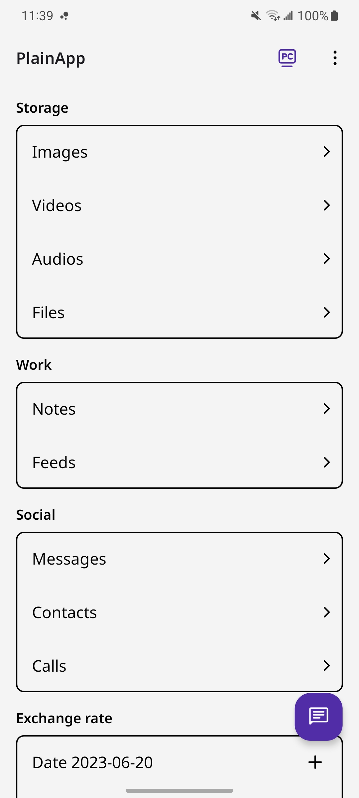

# PlainApp - 简朴

<a href="README.md">English</a>

简朴是一个开源应用，允许您通过网络浏览器管理您的手机。您可以通过安全、易于使用的网络界面从桌面访问文件、视频、音乐、联系人、短信、通话记录等等！

[](https://play.google.com/store/apps/details?id=com.ismartcoding.plain)
[](https://f-droid.org/packages/com.ismartcoding.plain/)
[](https://github.com/ismartcoding/plain-app/releases/latest)

## 功能

- 关注隐私：并使用 TLS + AES-GCM-256 加密，确保您的数据安全。
- 永久无广告：在使用简朴时，您不会被广告轰炸。
- 无云服务或第三方数据存储：所有数据保存在您的设备上，因此您完全控制您的信息。
- 无 Firebase Cloud Messaging/Analytics：不追踪您的活动，也不将您的数据用于广告目的。只通过 Firebase Crashlytics 收集崩溃日志。
- 用户友好：PlainApp 拥有现代、可自定义的界面，支持多语言，提供浅色/深色主题选项，并支持电子墨水屏幕。
- 桌面管理：您可以通过访问自托管的网页在桌面上管理您的手机。
- 联系人管理：您也可以在自托管的网页上管理这些功能。
- 文件管理：在自托管的网页上管理文件、图像、视频和音频。
- 记事本功能：使用内置的Markdown编辑器中管理您的笔记。
- RSS 阅读器：在干净的界面中阅读文章。
- 电视投射：将您的视频、图像和音频投射到您的电视上。
- 视频和音频播放：在应用内和网页上播放视频和音频。
- 备份和导出：备份和导出您的应用数据以进行安全保存。
- ChatGPT 对话界面（仅限网页）
- 短信、通话：在网页上阅读您的短信和通话记录。（仅限Apk版）
- 应用程序：查看您的应用程序并从手机下载apk。（仅限网页）
- 屏幕镜像：在网页上镜像您的手机屏幕。
- 工具：汇率、声音测量仪。
- 还有更多功能计划在未来推出。

简朴的极简设计是有意为之，让您能够专注于最重要的事情：您宝贵的数据。

视频: https://www.youtube.com/watch?v=RvO18j4r95o

Reddit: https://www.reddit.com/r/plainapp

Discord: https://discord.gg/RQWcS6DEEe

## 免责声明

- ⚠️ 本项目正处于**非常活跃**的开发阶段。
- ⚠️ 请预期可能会有错误和突破性的变更。
- ⚠️ 该项目并不完美，我始终在寻找改进的方法。如果您发现应用程序缺少某个功能，请随时提交功能请求。
- ⚠️ 我恳请大家友好地提问并参与讨论。

## 捐赠 :heart:

**这个项目需要您！** 如果您希望支持这个项目的进一步开发，支持项目的创作者或持续的维护工作，**请随意捐赠**。

我将不胜感激。谢谢您！

- [Buy me a cup of Ko-Fi!](https://ko-fi.com/ismartcoding)

- 使用微信扫码捐赠


## 截图

|    |             |                     |                      |
|--------------------------------------|-----------------------------------------|-----------------------------------------------|--------------------------------------------------|
|          |            |                  |                        |
|     |    |          |               |
|   |  |      |         |
|  |          |  |  |
|   |        |       |                                                  |

## 兼容性

简朴需要安卓9.0或更高版本。

##  计划

-   ❌ 未开始
-   🟡 开发中
-   ✅ 已完成

| 功能            | WEB | APP |
|---------------|:---:|:--:|
| Material you主题 | 🟡  | 🟡 |
| 通过网页链接分享文件    | ❌  | ❌  |
| 装有 PlainApp 的手机之间互发消息(蓝牙、Wi-Fi)    | ❌  | ❌  |
| 翻译字典    | ❌  | ❌  |
| 书籍    | ❌  | ❌  |
| 待办事项    | ❌  | ❌  |

最终目标是将智能手机变成个人数据和知识管理器，每个人都能够轻松地通过PlainApp互相共享知识和数据。

## 支持

如果您遇到任何问题，请随时在 GitHub 上提交一个问题。我乐意提供帮助。请不要随意给一星评价。

## 从PlainBox下载GraphQL模版

```bash
./gradlew downloadApolloSchema \
  --endpoint="http://<box-ip>:8080/graphql" \
  --schema="app/src/main/graphql/com/ismartcoding/plain/schema.graphqls" \
  --header="Authorization: Bearer <token>"
```

## 构建

1. 在`$rootProject/app`文件夹下生成`release.jks`文件。

```bash
keytool -genkey -v -keystore ./app/release.jks -keyalg RSA -keysize 2048 -validity 10000 -alias plain
```

2. 在`$rootProject`文件夹下创建`keystore.properties`文件，并添加以下内容。

```
storePassword=
keyPassword=
keyAlias=plain
storeFile=release.jks
```

## 星标历史

[](https://star-history.com/#ismartcoding/plain-app&Date)


